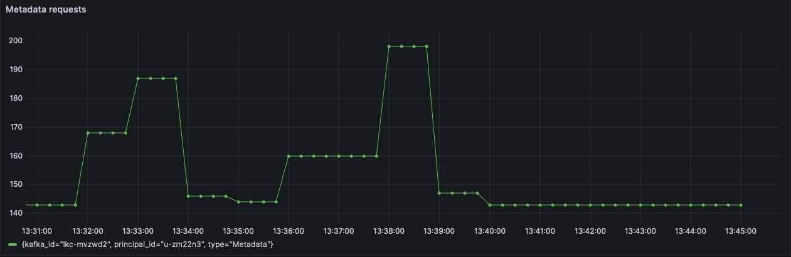
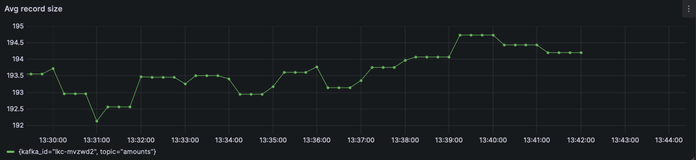

## Resilience dashboard

This project provides examples of dashboards for improving the resileince and usage patterns of shared resources, such as Confluent Cloud clusters. 

Please note that this is not an exhaustive list and further metrics can be added for better observability of shared resource usage.   


### Data Sources

Two data sources are used: 

#### Confluent Cloud metrics API

Easily accessible to a central team and can be used to monitor client activity across enviroments, clusters and domains. 

Can be accesses via scraping for lower resolution metrics as well as queries for higher, adjustable resolution and higher cardinality.

Not all important metrics are accessible. 

A template for a Prometheus scraper job for the Confluent Cloud Metrics API: 

```yaml
  - job_name: Confluent Cloud
    scrape_interval: 1m
    scrape_timeout: 1m
    honor_timestamps: true
    static_configs:
      - targets:
        - api.telemetry.confluent.cloud
    scheme: https
    basic_auth:
      username: CCLOUD_API_KEY
      password: CCLOUD_SECRET
    metrics_path: /v2/metrics/cloud/export
    params:
      resource.kafka.id: [lkc-xxx]  
```

#### Kafka Client JMX metrics

Need to be explicitly exposed by the clients and made available on pre-arranged endpoints. 

Can provide a high-resolution and detailed insight into the inner workings and connectivity of clients.

A template for a Prometheus scraper job for Client JMX metrics provided by a Quarkus-based application: 

```yaml
  - job_name: "quarkus_app"
    scrape_interval: 1m
    scrape_timeout: 30s
    metrics_path: /q/metrics/prometheus
    scheme: http
    static_configs:
      - targets: 
        - localhost:8080
```

### Prerequisites for improved results

Most metrics are grouped by a number of attributes. Confluent Cloud metrics are often grouped by the cluster ID and the principal - typically a Service Account ID. These are Confluent-specific identifiers. 

Thus, additional information is required to directly act on these metrics. In this case:
* a mapping from a cluster ID to a cluster name and environment. 
* a mapping from the environment and cluster ID to the responsible and their contact data.  
* a mapping from the service account ID to an application.
* a mapping from the application to the responsbile team and their contact data. 

Additionally, a fine-granular mapping of service accounts to individual applications can help in pinpointing and addressing the issue quicker. 

For most of the follwing metrics, it is not possible to define a unified value to alert on, due to different application patterns and expecteations. The limits should be defined iteratively, in collaboration between the client and the cluster/observability/governance teams. 

## Confluent Cloud metrics

### -- LeaveGroup & JoinGroup request rate

#### What? 

These requests are emitted by clients on consumer group changes. This happens both on voluntary and involuntary changes. Example for voluntary changes are starting, stopping or resizing an application. Involuntary changes 

#### Why

Unexpected LeaveGroup&JoinGroup requests (especially JoinGroup, since a failing client may not always send a LeaveGroup request) can indicate issues with applications. When processing times out, poison pills are processed, clients will be excluded from consumer groups, triggering rebalances. 

Clients with these issues tend to create an unnecessary load on the cluster, reprocessing records multiple times, without making progress. 

Typical issues with the clients leading to these issues include communicating with external systems in consumer loops in an unbounded way, processing too many records in a single processing loop, not handling deserialization and preocessing exceptions.   

#### How? 

It is difficult to define a specific critical value for alerting for this metric, since larger-scale, or repeated events, such as starting or restarting of applications can lead to false-positive alerts.

To make this metric actionable, correlation wtih other deployment parameters need to be made, e.g. when were applications deployed, redeployed, restarted. 


### -- Metadata requests per minute



#### What

To send produce and consume rquests to correct brokers, clients need to know which brokers own which partitions. This information is provided via metadata responses to metadata requests.

#### Why

A client exhibiting a high rate of metadata requests might have troubles connecting to the right broker. Perhaps the topics it needs to work properly do not exist. These clients can generate load on the cluster via repeated requests without performing any work.   

Unexecpectedly high rate of metadata requests should be investigated to ensure correct configuration and provisioning of required resources.   

#### How

No specific clitical value for alerting can be reaonably defined across clients. A relatively high rate of metadata requests should be verifies with the clients implementing team. Some clients may implement a liveness probe that works in terms of metadata requests.

### -- Offset commit rate

#### What

Consumers need to commit the offsets to record the current progress of record processing. Should the consumer fail, it will receive records starting from the last committed offset after restarting.   

The broker-side consumer lag will decrease only after the consumer committed offsets. 

#### Why 

Each offset commit generates additional cluster load. 

One reason for an high and unwarrented rate of offset commits is commiitting offsets after every processed record. While this approach can reduce teh cumber of reprocessed records in case of an error (the usual number of reprocessed records woulb be `max.poll.records`), this also constantly generates a load on the cluster.   


#### How

There is no on-size-fits-all rate to fit all clients. We recommend comparing rates between clients and over time and clarify client-specific requirements.   


### -- Heartbeats per minute

#### What

#### Why 

#### How

### -- Bytes per request estimate

#### What

#### Why 

#### How

### -- Average record size estimate



#### What

#### Why 

#### How

### -- Records per request estimate

`sum by(kafka_id) (rate(confluent_kafka_server_received_records[5m])) / on(kafka_id) sum by(kafka_id) (rate(confluent_kafka_server_request_count{type="Produce"}[5m]))`

#### What

This is a synthetic metric, created as a rate of records over the rate of produce requests.

#### Why 

Applications producing a low number of records per produce request might exhibit suboptimal batching and compression, additionally increasing the cluster load through a high number of small produce reqeusts.  

#### How

## Client metrics

### -- Client failed authentication rate

#### What

Aggregates consumer, producer and admin client metrics.

#### Why 

A client failing authentication should be a rare, intermittent occurrence. A client consistently failing authentication generates unnecessary load on the cluster without performing any useful work. 

Often, failed authentication is due to issues with credential provisioning, e.g. keys being rotated. 

#### How

Short spikes can be disregarded, but longer (> 10 seconds), sustained failures should lead to a client being halted and the error investigated and addressed.


### -- Record errors

#### What

Records which were not written to the target topic. 

#### Why 

Record errors can lead to data loss, and data loss can be a significant source of business errors.  

#### How

Any number above zero should be investigated, except in cases where data loss is acceptable (e.g. low-value sensors).


### -- Consumer rebalances per hour

#### What

This is the client-side variant of LeaveGroup/JoinGroup request monitoring, directly measuring the rebalances, responsible for triggering the LeaveGroup/JoinGroup requests.  

#### Why 

Consumer groups are expected to rebalance rarely, when the consumer group resizes. Consumer groups rebalancing frequently or constantly can mean a problem in the processing or the data. Rebalancing consumers will reprocess data without making significant progress, potentially even generating a constent stream of duplicates downstream. 

#### How

Please note that the cooperative rebalance protocol for Kafka Streams may trigger probing rebalances while waiting for a task on the target instance to catch up, in order to prevent processing interruptions. Probing rebalances happen every 10 mintes by default, until a perfect balance has been achieved.  

### -- Producer compression rate

#### What

A direct measure of If an error in a Kafka Steams thread was not handled, it will cause the thread to fail. 
Without compression, the rate is constantly at 1.0.

#### Why 

Using producer compression is generally recommended, as it can lead to a more efficient use of resources on the cluster as well as in downstream clients. 

Tracking compression rate can help discover clients not using compression, as well as, in combination with other metrics, clients using compression suboptimally, e.g. with small batches.  

#### How

Compression efficiency is higly dependent on the algorithm used. Different algorithms, such as gzip, lz4 etc, make different trade-offs in terms of CPU usage and compression effectiveness. 

Even more than the algorithm, the data influences the effectiveness of compression. Textual data compresses very well, while binary data may not.

Compression happens on batch level, so larger batches 

Please note, that despite higher compression rates with textual messages, binary encoding with compression are generally still significantly more space-efficient.  


### -- Throttle time ms

#### What

When clients reach their alotted throuhgput quotas, they are required to wait before making the next request. 

#### Why

Clients being throttled demonstates a non-alignment between client and cluster management. 

#### How

Clients w

A central management of client quotas, with low defaults and is recommended for shared clusters. The more broad the sharing, the more restricitve the quota handling should be in terms of both limits and process. 


### -- Failed stream threads

#### What

Only relevant for Kafka Streams client. 

If an error in a Kafka Steams thread was not handled, it will cause the thread to fail. 

#### Why 

#### How


### -- Task punctuate latency

#### What

Only relevant for Kafka Streams client. 

Punctuators are periodic tasks executed by Kafka Streams, mostly to perform tasks on data in state stores, e.g. deduplication, publishing aggregations, detencting missing events etc.

This metric records the duration of these tasks.  

#### Why 

Punctuation (periodic tasks) happens on the main thread in Kafka Streams. If it takes too long, the task may time out, leading to a rebalance. This is especially relevant for EOS with Kafka Streams. 

#### How

Please restrict the execution time of each punctuation, resuming on the next iteration. If this leads to furhter complications (e.g.the state store being analyzed too rarely), this issue may warrant a redesign of the application, or at least the partitioning.     

### --- 


## Alerting & Actions

The dashboards do not provide any alerting capabilities. However, exemplary visual thresholds are defined for most metrics


### Future work

* Introduce alerting integration

* 


